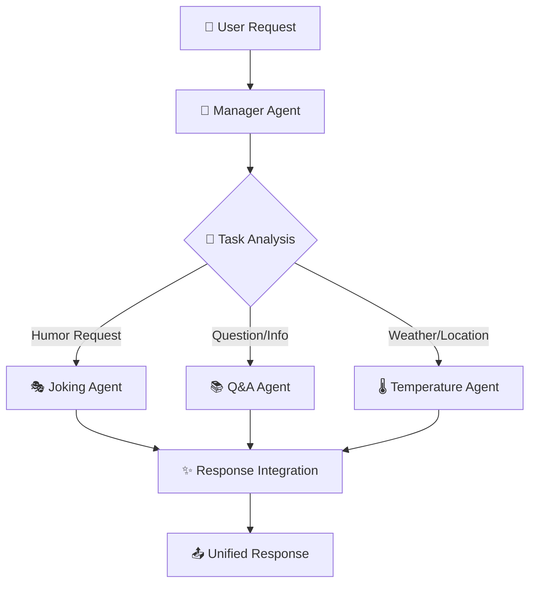

# 🤖 Intelligent Multi-Agent System

<div align="center">


*A sophisticated orchestration of specialized AI agents working in harmony*

</div>

---

## 🌟 Overview

Welcome to the **Intelligent Multi-Agent System** - a cutting-edge orchestration platform that seamlessly coordinates multiple specialized AI agents to deliver comprehensive solutions. Built on Google's ADK framework with Gemini 2.0 Flash, this system demonstrates the power of distributed AI intelligence.

### ✨ Key Features

- 🎯 **Intelligent Task Routing** - Automatic delegation to specialized agents
- 🧠 **Multi-Domain Expertise** - Covering humor, knowledge, and real-time data
- 🔄 **Seamless Integration** - Unified experience across multiple agents
- 🌐 **Real-Time Capabilities** - Live weather and location data
- 🎭 **Personality-Rich Interactions** - Each agent has its unique character

---

## 🏗️ Architecture



### 🎪 Meet Your AI Team

| Agent | Role | Specialty | Model |
|-------|------|-----------|-------|
| 🎯 **Manager** | Orchestrator | Task routing & coordination | Gemini 2.0 Flash |
| 🎭 **Joking Agent** | Entertainer | Nerdy jokes & humor | Gemini 2.0 Flash |
| 📚 **Q&A Agent** | Knowledge Expert | Information & answers | Gemini 2.0 Flash |
| 🌡️ **Temperature Agent** | Data Specialist | Weather & city information | Gemini 2.0 Flash |

---

## 🚀 Quick Start

### Why uv? ⚡

This project recommends **[uv](https://github.com/astral-sh/uv)** - the fastest Python package manager that's 10-100x faster than pip! It provides:
- ⚡ Blazing fast dependency resolution
- 🔒 Secure and reproducible builds  
- 🎯 Better dependency management
- 🐍 Built-in virtual environment handling

### Prerequisites

```bash
# Ensure you have Python 3.8+
python --version

# Install uv (modern Python package manager)
curl -LsSf https://astral.sh/uv/install.sh | sh
# or via Homebrew: brew install uv
# or via winget: winget install --id=astral-sh.uv
```

### Installation

1. **Clone the repository**
   ```bash
   git clone https://github.com/The-Unindented/Multi-agent_system.git
   cd Multi-agent_system
   ```

2. **Install dependencies with uv** ⚡
   ```bash
   # Create virtual environment and install dependencies
   uv venv
   uv add google-adk
   ```

3. **Configure your environment**
   ```bash
   # Set up your Google API credentials
   export GOOGLE_GENAI_USE_VERTEXAI=FALSE
   export GOOGLE_API_KEY="your-api-key-here"
   ```

### Usage

```python
uv run adk web --no-reload
```

---

## 🎨 Agent Personalities

### 🎭 Joking Agent
> *"Why do computer scientists confuse Halloween and Christmas? Because OCT 31 == DEC 25 🎃🎄"*

- **Specialty**: Nerdy humor, puns, and geeky pop culture
- **Tone**: Playful, witty, and encouraging
- **Perfect for**: Breaking the ice, lightening the mood, STEM humor

### 📚 Q&A Agent
> *"That's a great question — here's a simple way to look at it..."*

- **Specialty**: Comprehensive answers across all domains
- **Tone**: Knowledgeable, clear, and approachable
- **Perfect for**: Learning, research, problem-solving

### 🌡️ Temperature Agent
> *"Right now in Paris, it's 18°C (64°F). Known as the City of Light..."*

- **Specialty**: Real-time weather data and city insights
- **Tone**: Informative, warm, and travel-guide-like
- **Perfect for**: Travel planning, weather updates, city exploration

---

## 📁 Project Structure

```
multi-agent-system/
├── 📁 manager/
│   ├── __init__.py
│   ├── agent.py                 # 🎯 Main orchestrator
│   └── 📁 subagents/
│       ├── 📁 joking_agent/     # 🎭 Humor specialist
│       │   ├── __init__.py
│       │   └── agent.py
│       ├── 📁 qanda/            # 📚 Knowledge expert
│       │   ├── __init__.py
│       │   └── agent.py
│       └── 📁 tempreture_agent/ # 🌡️ Weather specialist
│           ├── __init__.py
│           └── agent.py
├── README.md
└── requirements.txt
```

---

## 🔧 Advanced Configuration

### Custom Agent Integration

Want to add your own specialized agent? Follow this pattern:

```python
from google.adk.agents import Agent

custom_agent = Agent(
    name="your_agent",
    model="gemini-2.0-flash",
    description="Your agent's purpose",
    instruction="Detailed instructions for your agent...",
    tools=[your_custom_tools]
)

# Add to manager's sub_agents or tools
```

### Environment Variables

| Variable | Description | Required |
|----------|-------------|----------|
| `GOOGLE_API_KEY` | Your Google API key for Gemini access | ✅ Yes |
| `GOOGLE_GENAI_USE_VERTEXAI` | Set to FALSE to use standard API | ✅ Yes |

---

## 🎯 Use Cases

### 🏢 Business Applications
- Customer service automation
- Multi-domain helpdesk systems
- Content generation workflows

### 🎓 Educational Platforms
- Interactive learning assistants
- Homework help systems
- Research coordination tools

### 🏠 Personal Productivity
- Daily information briefings
- Entertainment and relaxation
- Travel planning assistance

---

## 🔮 Future Roadmap

- [ ] 🌐 Web interface integration
- [ ] 📊 Analytics and usage tracking
- [ ] 🔌 Plugin architecture for custom agents
- [ ] 🎨 Visual agent interaction designer
- [ ] 📱 Mobile app companion
- [ ] 🔊 Voice interaction capabilities

---

## 🤝 Contributing

We welcome contributions! Here's how you can help:

1. **🍴 Fork** the repository
2. **🌿 Create** a feature branch (`git checkout -b feature/AmazingFeature`)
3. **💾 Commit** your changes (`git commit -m 'Add some AmazingFeature'`)
4. **📤 Push** to the branch (`git push origin feature/AmazingFeature`)
5. **🔄 Open** a Pull Request

### Development Guidelines

- Follow PEP 8 style guidelines
- Add comprehensive docstrings
- Include unit tests for new features
- Update documentation as needed

---

## 📜 License

This project is licensed under the MIT License - see the [LICENSE](LICENSE) file for details.

---

## 🙏 Acknowledgments

- **Google ADK Team** for the powerful agent framework
- **Gemini AI** for the exceptional language model capabilities
- **Open Source Community** for inspiration and best practices

---

<div align="center">

### 🌟 Star this repository if you found it helpful!

**Made with ❤️ and lots of ☕**

[Report Bug](https://github.com/The-Unindented/Multi-agent_system/issues) · [Request Feature](https://github.com/The-Unindented/Multi-agent_system/issues) · [Documentation](https://github.com/The-Unindented/Multi-agent_system/wiki)

</div>
